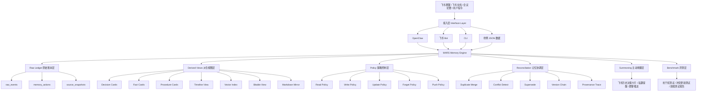
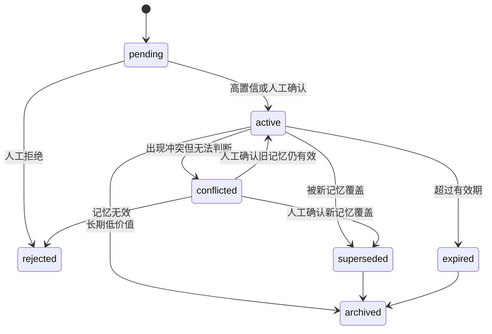

# MARS：面向飞书企业协作的 Agentic Memory Engine

MARS 是一个面向飞书企业协作场景的 Agentic Memory Engine。它不是简单的聊天记录搜索工具，也不是 OpenClaw 内部的记忆文件，而是一个独立部署、可被 OpenClaw / 飞书 Bot / CLI / 其他 Agent 调用的企业级记忆管理系统。

MARS 的目标是将飞书群聊、文档、会议纪要和用户操作中的碎片化历史，转化为可追溯、可检索、可更新、可遗忘、可主动唤醒的团队记忆。

## Core Idea

MARS 采用以下架构：

```text
Raw Ledger + Derived Views + Policy + Reconciliation + Summoning

Raw Ledger：原始事件账本，保存所有消息、文档、记忆变更和策略动作。
Derived Views：从原始账本派生出决策卡片、事实卡片、时间线、向量索引、多维表格等视图。
Policy：控制何时读、写、更新、遗忘和推送。
Reconciliation：处理重复、冲突、补充、覆盖和版本链。
Summoning：在合适时机主动唤醒历史决策、遗忘提醒和新人项目记忆包。
```

# 1. 项目总述

## 1.1 项目名称

**MARS：面向飞书企业协作的 Agentic Memory Engine**

英文全称：

**MARS: Memory Agent for Reconciliation and Summoning**

中文解释：

**MARS 是一个面向企业协作场景的记忆协调与主动唤醒引擎。**

---

## 1.2 一句话定位

MARS 不是一个简单的飞书聊天记录搜索工具，也不是 OpenClaw 内部的一个记忆文件，而是一个独立的、模型无关、Agent 无关、可被 OpenClaw / 飞书 Bot / CLI / 其他 Agent 调用的企业级 Memory Engine。

它的核心目标是：

> 将飞书群聊、飞书文档、会议纪要和用户操作中的碎片化历史，转化为可追溯、可检索、可更新、可遗忘、可主动唤醒的团队记忆。MARS 在记忆治理层借鉴 Git 的版本管理思想，对企业记忆对象进行版本记录、差异比较、冲突标记、覆盖关系维护和来源追溯。但与 Git 管理代码文本不同，MARS 管理的是语义化的企业记忆对象，例如项目决策、事实、流程和风险。
> 

---

## 1.3 项目最终要做出来什么

项目最终应交付一套可运行系统，而不是一份概念文档。

系统最终包含：

```
1. MARS Memory Engine 后端服务
2. 飞书 / OpenClaw 接入模块
3. 结构化记忆数据库
4. 向量检索索引
5. 飞书多维表格记忆控制台
6. 主动唤醒与推送模块
7. 冲突更新与版本管理模块
8. 遗忘提醒与复习模块
9. Benchmark 评测脚本与报告
10. 白皮书、README、演示视频、PPT
```

最终演示效果是：

```
飞书项目群产生大量讨论
        ↓
MARS 自动整理出项目决策、事实、流程、风险
        ↓
记忆进入数据库、向量库、飞书多维表格
        ↓
后续讨论触及相关话题时，系统主动推送历史决策卡片
        ↓
如果出现新旧矛盾，系统识别冲突并覆盖旧记忆
        ↓
如果重要记忆长期未被访问，系统触发复习提醒
        ↓
Benchmark 证明系统在抗干扰、冲突更新和效率提升上有效
```

---

# 2. 问题背景与核心挑战

## 2.1 企业协作中的“失忆”问题

在飞书这样的办公平台中，团队每天会产生大量信息：

```
项目群聊
飞书文档
会议纪要
任务分配
技术讨论
需求变更
客户反馈
上线问题
周报总结
```

这些信息中有很多对未来行动非常重要，例如：

```
之前为什么决定用方案 B？
这个接口字段到底有没有改？
老师上次确认的截止日期是哪天？
这个客户是不是要求保留英文导出字段？
这个文档是不是已经废弃？
周报现在到底发给 A 还是 B？
```

但是这些信息通常散落在长群聊、多文档和多轮会议中。随着时间推移，团队会出现：

```
重复讨论
历史决策遗忘
旧版本信息复活
新人无法理解上下文
关键约束被忽略
群聊搜索成本高
责任人和截止日期混乱
```

大模型 Agent 虽然推理能力强，但如果每次对话都从零开始，它仍然是“失忆”的。

---

## 2.2 现有方案不足

### 普通聊天记录搜索的问题

普通搜索只能找到原文，不能回答：

```
这是不是最终决策？
这个决策现在还有效吗？
后来有没有被覆盖？
当时为什么这样决定？
反对意见是什么？
来源证据在哪里？
```

---

### 普通 RAG 的问题

普通 RAG 通常是：

```
文本切块 → 向量检索 → 拼进 prompt → LLM 回答
```

它的问题是：

```
缺少时序管理
缺少版本管理
缺少冲突更新
缺少主动唤醒
缺少记忆生命周期
缺少来源审计
缺少团队协作可视化
```

也就是说，普通 RAG 解决的是“能不能查到”，但企业记忆系统要解决的是：

```
什么值得记？
怎么记？
什么时候更新？
旧记忆如何覆盖？
什么记忆应该遗忘？
什么时候主动提醒？
如何证明它真的有用？
```

---

## 2.3 OpenClaw 的定位

OpenClaw 可以部署在服务器或本机，也可以接入飞书。它可以读取服务器文件、飞书聊天上下文、飞书文档，并执行工具调用。

但 OpenClaw 本身更适合作为：

```
Agent 入口
工具调用器
上下文读取器
用户交互层
```

不应该把所有记忆管理逻辑都塞进 OpenClaw 内部。

MARS 的定位是：

```
OpenClaw 负责“使用记忆”
MARS 负责“管理记忆”
```

即：

```
OpenClaw = System 1，通用 Agent
MARS = System 2，专职记忆系统
```

---

# 3. 项目核心理念

## 3.1 Memory 不是存储，而是历史到决策的通道

本项目采用的核心观点是：

> Memory 的价值不在于存了多少历史，而在于历史能否在当前任务中以正确、可靠、低成本、可追溯的方式影响决策。
> 

你给的 Notion 笔记中有一个非常重要的判断：现阶段很多 memory 方案底层确实还是“外部状态管理 + 检索/压缩/回填 + 一点策略控制”，但它和普通提示词工程的区别在于，它把这些事做成了可持续、可审计、可回滚、可演化的系统；关键不只是有没有 LLM，而是有没有状态机、对象模型、闭环和治理能力。

因此，MARS 不把记忆看成一堆文本块，而是看成一套对象化、状态化、可治理的系统。

---

## 3.2 MARS 的三件套

MARS 的底层抽象是：

```
Raw Ledger + Derived Views + Policy
```

### Raw Ledger：原始账本

负责保存原始事件：

```
谁说了什么
在哪个群里说的
什么时候说的
系统什么时候记录的
后来有没有更新
来源证据在哪里
```

它是 source of truth。

---

### Derived Views：派生视图

从 Raw Ledger 中派生出面向不同用途的记忆视图：

```
决策卡片
事实卡片
流程卡片
风险卡片
项目时间线
向量索引
关键词索引
飞书多维表格
Markdown 记忆文件
```

---

### Policy：策略控制层

决定：

```
什么时候读 memory
读什么 memory
读多少 memory
什么时候写入
写成什么类型
什么时候更新
什么时候遗忘
什么时候主动推送
```

---

## 3.3 MARS 的闭环

完整记忆闭环是：

```
飞书事件
  ↓
Raw Ledger
  ↓
Derived Views
  ↓
Policy 决策
  ↓
检索 / 推送 / 更新 / 遗忘
  ↓
Commit 回写
  ↓
Provenance 溯源
```

这个闭环是 MARS 区别普通 RAG、普通摘要工具和普通数据库的核心。

## LLM 与规则系统的分工

MARS 不是全程依赖 LLM，也不是纯代码规则系统，而是采用：

```
规则 / 代码负责确定性治理；
LLM 负责语义理解和结构化抽取；
数据库负责状态管理；
向量库负责召回；
Policy 负责控制何时调用 LLM。
```

LLM 负责：

```
1. 从讨论窗口中抽取候选记忆；
2. 将候选记忆整理为 Memory Object；
3. 判断新旧记忆关系：duplicate / support / update / conflict / supersede / unrelated；
4. 生成历史决策推送卡片；
5. 生成新人项目记忆包；
6. 在 Benchmark 中作为 GPT-as-judge 进行质量评分。
```

代码负责：

```
1. Raw Event 入库；
2. 状态机流转；
3. 版本号管理；
4. active / superseded / archived / expired 的状态更新；
5. valid_time / transaction_time 处理；
6. 向量检索和关键词检索；
7. 推送频控；
8. Policy Action 记录；
9. Benchmark 统计；
10. 来源追溯。
```

可以加一句总结：

> LLM 做语义，代码做治理，数据库做状态，Policy 做调度。
> 

---

# 4. 项目目标与边界

## 4.1 项目目标

MARS 的目标是构建一套企业级记忆管理框架，具体包括：

```
1. 从飞书群聊和文档中自动提取团队记忆
2. 将记忆结构化为标准 Memory Object
3. 支持原始证据追溯
4. 支持语义检索和关键词检索
5. 支持记忆冲突检测与版本覆盖
6. 支持主动唤醒历史决策
7. 支持重要记忆的遗忘提醒
8. 支持飞书多维表格可视化管理
9. 支持 OpenClaw、飞书 Bot、CLI 等多入口调用
10. 通过 Benchmark 证明系统有效
```

---

## 4.2 项目不做什么

第一版不做：

```
不训练新的大模型
不做 logit 调制
不做 latent memory token
不做 KV-cache 注入
不做完整 TKG 时序知识图谱
不做复杂多模态记忆
不做生产级权限系统
不做完整人脑模拟
```

这些可以作为未来工作。

---

## 4.3 项目主线选择

比赛给出的 A/B/C/D 四个方向中，本项目采用：

```
主线：B + D
辅助：C 的轻量个人偏好
扩展说明：A 的 CLI 记忆不作为主线
```

即：

| 方向 | 是否实现 | 处理方式 |
| --- | --- | --- |
| A：CLI 高频命令记忆 | 不作为主线 | 作为未来扩展，说明 MARS 通用性 |
| B：飞书项目决策记忆 | 核心主线 | 必做 |
| C：个人工作习惯记忆 | 轻量实现 | 只做通知偏好、展示偏好 |
| D：团队知识断层与遗忘预警 | 核心主线 | 必做 |

项目真正聚焦：

> 飞书项目群中的团队决策记忆与知识断层治理。
> 

LLM 负责：

1. 候选记忆抽取

2. Memory Object 生成

3. 新旧记忆关系判断

4. 推送卡片生成

5. 新人项目记忆包生成

6. GPT-as-judge 评分

代码负责：

1. Raw Event 入库

2. 状态机

3. 版本号

4. Supersede 更新

5. 向量检索

6. 关键词检索

7. 频控

8. Benchmark 统计

9. 来源追溯

---

# 5. 总体系统架构

## 5.1 总体架构图



---

## 5.2 系统分层

MARS 分为 8 个核心层：

```
1. Interface Layer：外部接入层
2. Raw Ledger Layer：原始账本层
3. Memory Extraction Layer：记忆提取层
4. View Layer：派生视图层
5. Retrieval Layer：检索层
6. Policy Layer：策略控制层
7. Reconciliation Layer：记忆协调层
8. Benchmark Layer：评测层

Raw Ledger 类似 Git commit log，用于保留历史；
Reconciliation 类似 merge/conflict resolution，用于处理新旧记忆关系；
Provenance 类似 blame，用于追踪某条记忆来自哪条消息或文档；
Supersede 类似版本覆盖，用于标记旧记忆已被新记忆替代。
MARS 的比较不是文本 diff，而是语义 diff。
```

# 6. 核心记忆对象设计

## 6.1 Memory Object 总体结构

MARS 中每一条长期记忆都不是普通文本，而是一个结构化对象。

```json
{
  "memory_id": "mem_20260501_001",
  "memory_type": "decision",
  "scope": "project",
  "tenant_id": "demo_tenant",
  "project_id": "carbon_platform",
  "user_id": null,
  "topic": "技术路线",
  "title": "一期 Demo 采用 Streamlit",
  "content": "一期 Demo 先采用 Streamlit，正式版再考虑 Vue + FastAPI。",
  "rationale": [
    "比赛周期短",
    "已有 Python 数据处理代码",
    "Streamlit 可以快速完成可视化闭环"
  ],
  "objections": [
    "Streamlit 工程化程度弱于 Vue + FastAPI"
  ],
  "status": "active",
  "version": 1,
  "confidence": 0.86,
  "importance": 4,
  "valid_time_start": "2026-05-01T10:00:00",
  "valid_time_end": null,
  "transaction_time": "2026-05-01T10:30:00",
  "source_event_ids": ["evt_001", "evt_002", "evt_003"],
  "supersedes": null,
  "superseded_by": null,
  "created_at": "2026-05-01T10:30:00",
  "updated_at": "2026-05-01T10:30:00"
}
```

---

## 6.2 记忆类型

MARS 第一版设计 7 类记忆。

| 类型 | 中文名 | 说明 | 第一版是否实现 |
| --- | --- | --- | --- |
| decision | 决策记忆 | 团队确认的方案、选择、结论 | 必做 |
| fact | 事实记忆 | 项目中当前有效的事实 | 必做 |
| procedure | 流程记忆 | 团队如何做某事 | 必做 |
| risk | 风险记忆 | 踩坑、约束、注意事项 | 建议做 |
| preference | 偏好记忆 | 个人或团队偏好 | 轻量做 |
| episode | 情景记忆 | 某次具体讨论或事件过程 | 可选 |
| skill | 技能记忆 | 可执行、可复用工作流 | 可选加分 |

---

## 6.3 记忆作用域

每条记忆都有 scope：

```
user：个人记忆
team：团队记忆
project：项目记忆
org：组织记忆
```

第一版重点做：

```
project
team
```

轻量支持：

```
user
```

---

## 6.4 记忆状态机

记忆不是写进去就永远 active，而是有生命周期。



状态含义：

| 状态 | 含义 |
| --- | --- |
| pending | 待确认 |
| active | 当前有效 |
| superseded | 已被新记忆覆盖 |
| expired | 已过有效期 |
| conflicted | 存在冲突，需确认 |
| archived | 归档，不主动召回 |
| rejected | 被拒绝，不进入长期记忆 |

---

# 7. 核心模块详细设计

---

# 7.1 Interface Layer：接入层

## 7.1.1 目标

接入外部系统，将不同来源的数据统一转换成 MARS 内部事件格式。

## 7.1.2 接入对象

```
飞书群聊
飞书文档
飞书多维表格
飞书 Bot
OpenClaw
CLI
本地样例 JSON
```

## 7.1.3 第一版接入优先级

```
P0：本地样例 JSON
P0：CLI
P1：飞书多维表格
P1：飞书 Bot
P1：OpenClaw Tool
P2：真实飞书文档读取
P2：真实飞书群聊长连接监听
```

## 7.1.4 输出标准 Raw Event

```
{
  "event_id":"evt_001",
  "event_type":"message.created",
  "source_type":"feishu_chat",
  "source_id":"msg_xxx",
  "tenant_id":"tenant_demo",
  "project_id":"carbon_platform",
  "chat_id":"chat_001",
  "actor_id":"user_001",
  "content":"我们一期先用 Streamlit，后面正式版再 Vue + FastAPI。",
  "payload_json": {},
  "transaction_time":"2026-05-01T10:10:00",
  "valid_time_start":"2026-05-01T10:10:00",
  "valid_time_end":null
}

            运行
```

---

## 多源数据 Adapter 机制

MARS 不直接依赖 OpenClaw 或飞书的原始格式，而是定义统一的 Raw Event Schema。所有来源都先经过 Adapter 转换：

```
sample JSON → sample_adapter → Raw Event
OpenClaw context → openclaw_adapter → Raw Event
Feishu event → feishu_event_adapter → Raw Event
CLI input → cli_adapter → Raw Event
```

统一 Raw Event 建议补充字段：

```
{
  "event_id":"evt_001",
  "event_type":"message.created",
  "source_type":"feishu_chat",
  "source_id":"msg_001",
  "tenant_id":"tenant_demo",
  "project_id":"carbon_platform",
  "chat_id":"chat_001",
  "thread_id":null,
  "actor_id":"user_001",
  "actor_name":"张三",
  "content":"一期先用 Streamlit 吧",
  "content_type":"text",
  "mentions": [],
  "reply_to":null,
  "raw_payload": {},
  "transaction_time":"2026-05-01T10:00:00",
  "valid_time_start":"2026-05-01T10:00:00",
  "valid_time_end":null,
  "source_url":null
}

            运行
```

这里需要特别强调：

```
raw_payload 必须保留原始平台数据，便于后续排错、回放和适配不同 OpenClaw / 飞书版本。
```

# 7.2 Raw Ledger Layer：原始账本层

## 7.2.1 目标

保存所有原始事件，作为系统的权威记录。

## 7.2.2 Ledger 原则

```
1. append-only：只追加，不直接覆盖
2. provenance：所有高层记忆都能回到原始事件
3. replayable：可以重放历史构建视图
4. auditable：可以审计谁在什么时候写入了什么
5. bitemporal：支持 transaction_time 和 valid_time
```

## 7.2.3 raw_events 表

```
CREATETABLE raw_events (
    event_id TEXTPRIMARYKEY,
    event_type TEXTNOTNULL,
    source_type TEXTNOTNULL,
    source_id TEXT,
    tenant_id TEXT,
    project_id TEXT,
    chat_id TEXT,
    actor_id TEXT,
    content TEXT,
    payload_json TEXT,
    transaction_time TEXT,
    valid_time_start TEXT,
    valid_time_end TEXT,
    created_at TEXT
);
```

---

# 7.3 Memory Extraction Layer：记忆提取层

## 7.3.1 目标

从飞书讨论和文档中提取值得长期保存的记忆。

## 7.3.2 为什么不能单条消息提取

飞书项目讨论通常是：

```
发散讨论 → 方案比较 → 反对意见 → 收束确认 → 后续修正
```

单条消息无法判断：

```
这是不是最终决策？
有没有人反对？
是否只是建议？
后面有没有被推翻？
```

因此要用“讨论窗口”提取。

---

## 7.3.3 Window Builder：讨论窗口构造

输入：

```
最近 N 条消息
一个飞书 thread
一个文档片段
一个会议纪要
```

切分方式：

```
按时间窗口：例如 30 分钟
按 thread：同一回复链归为一组
按主题：关键词或 embedding 聚类
按用户命令：/memory_digest 最近 100 条
```

输出：

```
{
  "window_id":"win_001",
  "project_id":"carbon_platform",
  "topic_hint":"技术路线",
  "event_ids": ["evt_001","evt_002","evt_003"],
  "start_time":"2026-05-01T10:00:00",
  "end_time":"2026-05-01T10:30:00"
}

            运行
```

---

## 7.3.4 Candidate Extractor：候选记忆抽取

输入：

```
一个讨论窗口中的消息列表
```

输出：

```
{
  "candidate_id":"cand_001",
  "candidate_type":"decision",
  "topic":"技术路线",
  "summary":"团队阶段性确认一期 Demo 先采用 Streamlit。",
  "evidence_event_ids": ["evt_001","evt_002","evt_003"],
  "confidence":0.82,
  "need_human_confirm":false
}

            运行
```

抽取规则：

```
只提取对未来行动有影响的信息
不提取寒暄闲聊
不提取普通情绪表达
不把个人建议误判为团队决策
必须给出证据事件
置信度低则进入 pending
```

---

## 7.3.5 Memory Normalizer：记忆标准化

将 candidate 转成 Memory Object。

补全字段：

```
memory_type
scope
project_id
topic
title
content
rationale
objections
confidence
importance
valid_time
status
source_event_ids
```

---

# 7.4 View Layer：派生视图层

## 7.4.1 目标

从 Raw Ledger 和 Memory Object 中生成不同使用场景的视图。

## 7.4.2 第一版 Views

| View | 用途 | 技术 |
| --- | --- | --- |
| Decision Card View | 展示和推送项目决策 | SQLite |
| Fact View | 保存当前有效事实 | SQLite |
| Procedure View | 保存流程约定 | SQLite |
| Timeline View | 回放项目演化 | SQL |
| Vector Index View | 语义检索 | Chroma / FAISS |
| Keyword Index View | 精确检索 | SQLite FTS / BM25 |
| Bitable View | 飞书可视化 | 飞书多维表格 |
| Markdown Mirror | 人类可读导出 | Markdown |

---

## 7.4.3 Markdown Mirror 设计

借鉴成熟 Agent 系统中“项目级记忆文件”的思想，MARS 会导出一份可读镜像：

```
memory_files/
├── MEMORY_INDEX.md
├── projects/
│   ├── carbon-platform/
│   │   ├── decisions.md
│   │   ├── facts.md
│   │   ├── procedures.md
│   │   ├── risks.md
│   │   └── timeline.md
│   └── mars-project/
│       ├── decisions.md
│       ├── facts.md
│       └── timeline.md
├── teams/
│   └── team-memory.md
└── users/
    └── user-preferences.md
```

注意：

```
数据库是主存储
Markdown 是导出镜像
飞书多维表格是协作控制台
向量库是检索索引
```

---

# 7.5 Retrieval Layer：检索层

## 7.5.1 目标

在用户查询或群聊触发时，找出当前最相关、最有效、最可信的记忆。

## 7.5.2 不采用单纯向量检索

MARS 使用 Hybrid Retrieval：

```
项目过滤
类型过滤
状态过滤
时间过滤
关键词检索
向量检索
LLM / 规则重排
来源证据组装
```

## 7.5.3 检索流程

```
用户问题 / 当前群聊上下文
        ↓
Query Analyzer 解析 project、topic、time_scope
        ↓
Scope Filter 过滤项目和团队
        ↓
Status Filter 默认只查 active
        ↓
Time Filter 处理 valid_time
        ↓
Hybrid Search 关键词 + 向量
        ↓
Rerank 重排
        ↓
Evidence Pack 输出
```

## 7.5.4 Evidence Pack

```
{
  "query":"之前为什么不用 Vue？",
  "time_scope":"current",
  "evidence": [
    {
      "memory_id":"mem_001",
      "title":"一期 Demo 采用 Streamlit",
      "status":"active",
      "score":0.87,
      "content":"一期先采用 Streamlit，正式版再考虑 Vue + FastAPI。",
      "rationale": [
"比赛周期短",
"已有 Python 代码"
      ],
      "source_event_ids": ["evt_001","evt_002"],
      "source_url":"feishu://..."
    }
  ]
}

            运行
```

---

# 7.6 Policy Layer：策略控制层

## 7.6.1 目标

Policy 决定记忆系统什么时候读、写、更新、遗忘和推送。

## 7.6.2 第一版 Policy 实现方式

不训练小模型，采用：

```
规则 Policy + LLM 语义判断
```

原因：

```
训练 controller 成本高
比赛重点是系统闭环
规则更可控
LLM 负责语义理解即可
```

---

## 7.6.3 Read Policy

触发检索的情况：

```
用户问“之前”“当时”“为什么”“谁负责”“截止日期”
当前群聊出现“是不是已经决定”“要不要改”
OpenClaw 执行任务前需要项目上下文
定时生成周报或复盘
```

不触发检索的情况：

```
普通闲聊
无项目上下文
低价值消息
重复触发
```

---

## 7.6.4 Write Policy

写入条件：

```
包含明确决策
包含长期事实
包含流程约定
包含风险提醒
包含责任分配
包含截止日期
包含用户主动“记住”
```

不写入：

```
寒暄
吐槽
无结论争论
单人未确认建议
重复信息
低置信摘要
```

---

## 7.6.5 Update Policy

新旧记忆相似时，判断关系：

```
duplicate：重复
support：支持
update：补充
conflict：冲突
supersede：覆盖
unrelated：无关
```

优先进入 supersede 的触发词：

```
不对
改成
取消之前
以后统一
以新的为准
之前那个不用了
改为
```

---

## 7.6.6 Forget Policy

MARS 不直接删除记忆，而是：

```
降权
归档
过期
覆盖
提醒复习
```

MemoryScore：

```
MemoryScore = Importance × Confidence × Freshness × AccessFactor × StatusFactor
```

处理规则：

```
高重要 + 久未访问 → 复习提醒
低重要 + 久未访问 → archived
被覆盖 → superseded
超过有效期 → expired
冲突不明 → conflicted
```

---

## 7.6.7 Push Policy

主动推送条件：

```
当前讨论与 active memory 相似度高
关键词命中
同一记忆近期未推送
记忆重要性较高
推送不会过度打扰
```

频控规则：

```
同一记忆 24 小时最多推送 1 次
同一话题连续讨论只推送一次
置信度低于 0.75 不主动推送
非 active 记忆默认不主动推送
```

---

# 7.7 Reconciliation Layer：记忆协调层

## 7.7.1 目标

处理重复、补充、冲突、覆盖和版本链。

## 7.7.2 输入

```
new_memory
similar_old_memories
raw evidence
time information
```

## 7.7.3 输出

```
{
  "relation":"supersede",
  "old_memory_id":"mem_001",
  "new_memory_id":"mem_009",
  "reason":"新消息明确表示“不对，一期改为 Vue + FastAPI”，覆盖旧技术路线。",
  "action":"mark_old_superseded_and_activate_new"
}
```

## 7.7.4 关系类型

| 关系 | 说明 | 动作 |
| --- | --- | --- |
| duplicate | 重复 | 合并证据 |
| support | 支持 | 增强置信度 |
| update | 补充 | 新增版本或更新字段 |
| conflict | 冲突但不能判断 | 标记 conflicted |
| supersede | 明确覆盖 | 旧 active → superseded |
| unrelated | 无关 | 新增 |

---

## Git-like Memory Governance：面向语义记忆对象的版本治理

写法可以是：

> MARS 在 Reconciliation 层借鉴 Git 的版本治理思想。不同于 Git 管理代码文件，MARS 管理的是语义化企业记忆对象。系统不会直接覆盖旧记忆，而是通过 Raw Ledger、Memory Version、Memory Edge 和 Reconciliation Log 记录每一次新增、合并、冲突和覆盖。
> 

对应关系：

| Git 概念 | MARS 对应设计 |
| --- | --- |
| commit | raw_event / policy_action |
| diff | semantic memory diff |
| merge | memory merge |
| conflict | conflicted memory |
| revert | correction / supersede event |
| blame | provenance trace |
| log | memory timeline |
| branch | project / phase / alternative plan |

再补一句：

> 普通用户只看当前有效结论，项目负责人看版本链，开发/评测人员看完整 Reconciliation Log。
> 

# 7.8 Summoning Layer：主动唤醒层

## 7.8.1 目标

让 MARS 不只是被动搜索，而是在合适时机主动提醒。

## 7.8.2 触发方式

```
关键词触发
语义触发
时间触发
遗忘触发
冲突触发
用户命令触发
```

第一版重点做：

```
关键词触发 + 语义确认
```

## 7.8.3 触发词

```
之前
当时
为什么
是不是已经决定
重新讨论
要不要改
不对
改成
统一
截止日期
负责人
接口
方案
技术路线
```

## 7.8.4 推送卡片格式

```
【历史决策提醒】

你们正在讨论：一期技术路线

系统检索到历史决策：
2026-05-01 团队确认一期 Demo 先采用 Streamlit，正式版再考虑 Vue + FastAPI。

理由：
1. 比赛周期短；
2. 已有 Python 数据处理代码；
3. Streamlit 能快速完成可视化闭环。

当前状态：active
来源：飞书项目群 10:12-10:45 讨论

是否需要重新打开该决策？
回复“更新记忆”可进入覆盖流程。
```

## 7.8.5 Newcomer Onboarding Memory Pack

```mermaid
新人入群 / 用户触发 onboarding 命令
        ↓
检索项目 active memories + 关键历史事件
        ↓
生成项目背景、关键决策、历史争议、当前方案、风险提醒、推荐阅读
```

---

# 7.9 Forgetting Layer：遗忘与复习层

## 7.9.1 目标

避免记忆无限增长，避免旧事实反复误导当前决策。

## 7.9.2 第一版实现

```
不物理删除
只做状态变化
只做检索降权
只做重要记忆提醒
```

## 7.9.3 复习提醒示例

```
【记忆复习提醒】

“客户 A 要求导出字段保留英文名”已 14 天未被访问，但重要性为 5。

请确认该记忆是否仍有效：
A. 仍然有效
B. 已过期
C. 需要修改
```

---

# 7.10 Benchmark Layer：评测层

## 7.10.1 目标

证明系统真的“记住了”，并产生实际效能。

## 7.10.2 三类必做测试

```
抗干扰测试
矛盾更新测试
效能指标验证
```

## 7.10.3 抗干扰测试

数据构造：

```
第 1 天注入关键记忆
第 2-7 天加入大量无关聊天
第 7 天提出相关问题
```

指标：

```
Recall@1
Recall@3
Answer Accuracy
Source Accuracy
Noise Robustness
```

---

## 7.10.4 矛盾更新测试

Case：

```
旧：以后周报发给 A
新：不对，以后周报统一发给 B

旧：一期使用 Streamlit
新：一期改为 Vue + FastAPI

旧：接口 user_id 是 int
新：接口 user_id 改成 string
```

指标：

```
Conflict Detection Accuracy
Supersede Accuracy
Temporal Accuracy
Status Accuracy
```

---

## 7.10.5 效能测试

对照：

```
无 MARS：人工翻飞书群聊和文档
有 MARS：直接问 Bot 或系统主动推送
```

指标：

```
查找时间
操作步数
输入字符数
来源定位成功率
重复讨论减少率
```

示例表：

| 任务 | 无 MARS | 有 MARS | 提升 |
| --- | --- | --- | --- |
| 查找技术路线决策 | 180 秒 | 12 秒 | 93.3% |
| 查找接口字段变更 | 120 秒 | 8 秒 | 93.3% |
| 查找周报负责人 | 60 秒 | 5 秒 | 91.7% |
| 输入字符数 | 50 字 | 10 字 | 80% |

# 8. 数据库设计

## 8.1 raw_events

```
CREATETABLE raw_events (
    event_id TEXTPRIMARYKEY,
    event_type TEXTNOTNULL,
    source_type TEXTNOTNULL,
    source_id TEXT,
    tenant_id TEXT,
    project_id TEXT,
    chat_id TEXT,
    actor_id TEXT,
    content TEXT,
    payload_json TEXT,
    transaction_time TEXT,
    valid_time_start TEXT,
    valid_time_end TEXT,
    created_at TEXT
);
```

---

## 8.2 memory_objects

```
CREATETABLE memory_objects (
    memory_id TEXTPRIMARYKEY,
    memory_type TEXTNOTNULL,
    scope TEXTNOTNULL,
    tenant_id TEXT,
    project_id TEXT,
    user_id TEXT,
    topic TEXT,
    title TEXT,
    content TEXT,
    rationale_json TEXT,
    objections_json TEXT,
    tags_json TEXT,
    status TEXT,
    versionINTEGER,
    confidenceREAL,
    importanceINTEGER,
    valid_time_start TEXT,
    valid_time_end TEXT,
    transaction_time TEXT,
    created_at TEXT,
    updated_at TEXT
);
```

---

## 8.3 memory_sources

```
CREATETABLE memory_sources (
    id TEXTPRIMARYKEY,
    memory_id TEXT,
    event_id TEXT,
    evidence_type TEXT,
    quote TEXT,
    source_url TEXT,
    created_at TEXT
);
```

---

## 8.4 memory_edges

```
CREATETABLE memory_edges (
    edge_id TEXTPRIMARYKEY,
    source_memory_id TEXT,
    target_memory_id TEXT,
    relation_type TEXT,
    reason TEXT,
    confidenceREAL,
    created_at TEXT
);
```

---

## 8.5 policy_actions

```
CREATETABLE policy_actions (
    action_id TEXTPRIMARYKEY,
    action_type TEXT,
    project_id TEXT,
    input_json TEXT,
    candidate_json TEXT,
    decision TEXT,
    reason TEXT,
    confidenceREAL,
    created_at TEXT
);
```

---

## 8.6 retrieval_logs

```
CREATETABLE retrieval_logs (
    log_id TEXTPRIMARYKEY,
    query TEXT,
    project_id TEXT,
    time_scope TEXT,
    retrieved_memory_ids TEXT,
    selected_memory_ids TEXT,
    latency_msINTEGER,
    created_at TEXT
);
```

---

## 8.7 push_logs

```
CREATETABLE push_logs (
    push_id TEXTPRIMARYKEY,
    trigger_type TEXT,
    chat_id TEXT,
    memory_id TEXT,
    push_content TEXT,
    user_feedback TEXT,
    created_at TEXT
);
```

---

## 8.8 benchmark_results

```
CREATETABLE benchmark_results (
    result_id TEXTPRIMARYKEY,
    benchmark_type TEXT,
    case_id TEXT,
    metric_json TEXT,
    passedINTEGER,
    created_at TEXT
);
```

---

# 9. 项目文件结构

```
mars-memory-engine/
├── README.md
├── .env.example
├── requirements.txt
├── configs/
│   ├── app.yaml
│   ├── llm.yaml
│   ├── memory_schema.yaml
│   └── policies.yaml
│
├── app/
│   ├── main.py
│   ├── api/
│   │   ├── ingest.py
│   │   ├── memory.py
│   │   ├── search.py
│   │   ├── reconcile.py
│   │   ├── summon.py
│   │   └── benchmark.py
│   │
│   ├── connectors/
│   │   ├── feishu_connector.py
│   │   ├── openclaw_adapter.py
│   │   ├── bitable_sync.py
│   │   ├── cli_adapter.py
│   │   └── sample_loader.py
│   │
│   ├── core/
│   │   ├── window_builder.py
│   │   ├── extractor.py
│   │   ├── normalizer.py
│   │   ├── retriever.py
│   │   ├── reconciler.py
│   │   ├── policy.py
│   │   ├── forgetting.py
│   │   ├── pusher.py
│   │   └── evaluator.py
│   │
│   ├── storage/
│   │   ├── db.py
│   │   ├── models.py
│   │   ├── ledger.py
│   │   ├── vector_store.py
│   │   ├── markdown_exporter.py
│   │   └── snapshot_store.py
│   │
│   └── llm/
│       ├── provider.py
│       ├── prompts.py
│       └── structured_output.py
│
├── data/
│   ├── sample_chats/
│   │   ├── project_day1_decision.json
│   │   ├── project_day7_noise.json
│   │   └── conflict_update.json
│   │
│   ├── sample_docs/
│   │   └── project_plan_v1.md
│   │
│   └── benchmark/
│       ├── anti_noise_cases.json
│       ├── conflict_cases.json
│       └── efficiency_cases.json
│
├── memory_store/
│   ├── mars.db
│   ├── chroma/
│   └── snapshots/
│
├── memory_files/
│   ├── MEMORY_INDEX.md
│   ├── projects/
│   │   ├── carbon-platform/
│   │   │   ├── decisions.md
│   │   │   ├── facts.md
│   │   │   ├── procedures.md
│   │   │   ├── risks.md
│   │   │   └── timeline.md
│   │   └── mars-project/
│   │       ├── decisions.md
│   │       ├── facts.md
│   │       └── timeline.md
│   │
│   ├── teams/
│   │   └── team-memory.md
│   │
│   └── users/
│       └── user-preferences.md
│
├── scripts/
│   ├── run_demo.py
│   ├── run_extract.py
│   ├── run_benchmark.py
│   ├── sync_to_bitable.py
│   └── export_memory_files.py
│
├── openclaw_tools/
│   ├── mars_memory_search.md
│   ├── mars_memory_digest.md
│   ├── mars_memory_update.md
│   └── mars_memory_review.md
│
└── reports/
    ├── whitepaper.md
    ├── benchmark_report.md
    └── demo_script.md
```

# 10. API 设计

## 10.1 导入消息

```
POST /api/ingest/messages
```

请求：

```
{
  "project_id":"carbon_platform",
  "chat_id":"chat_001",
  "messages": [
    {
      "message_id":"msg_001",
      "actor_id":"user_001",
      "content":"一期先用 Streamlit 吧",
      "timestamp":"2026-05-01T10:00:00"
    }
  ]
}

            运行
```

---

## 10.2 提取记忆

```
POST /api/memory/extract
```

请求：

```
{
  "project_id":"carbon_platform",
  "event_ids": ["evt_001","evt_002","evt_003"]
}
```

---

## 10.3 搜索记忆

```
POST /api/memory/search
```

请求：

```
{
  "project_id":"carbon_platform",
  "query":"之前为什么不用 Vue？",
  "time_scope":"current",
  "top_k":5
}
```

响应：

```
{
  "answer":"此前团队决定一期采用 Streamlit，原因是比赛周期短、已有 Python 代码，Streamlit 开发更快。",
  "memories": [
    {
      "memory_id":"mem_001",
      "title":"一期 Demo 采用 Streamlit",
      "status":"active",
      "source_event_ids": ["evt_001","evt_002"]
    }
  ]
}

            运行
```

---

## 10.4 冲突更新

```
POST /api/memory/reconcile
```

请求：

```
{
  "project_id":"carbon_platform",
  "new_statement":"不对，一期改成 Vue + FastAPI。"
}
```

响应：

```
{
  "relation":"supersede",
  "old_memory_id":"mem_001",
  "new_memory_id":"mem_009",
  "reason":"新消息明确覆盖旧技术路线。"
}
```

---

## 10.5 主动唤醒

```
POST /api/memory/summon
```

请求：

```
{
  "project_id":"carbon_platform",
  "chat_id":"chat_001",
  "recent_messages": [
"我们一期是不是应该换 Vue？"
  ]
}
```

响应：

```
{
  "should_push":true,
  "push_card":"【历史决策提醒】此前团队已确认一期先采用 Streamlit……"
}
```

---

## 10.6 运行评测

```
POST /api/benchmark/run
```

请求：

```
{
  "benchmark_type":"all"
}
```

响应：

```
{
  "anti_noise": {
    "recall_at_3":0.92,
    "source_accuracy":0.9
  },
  "conflict": {
    "supersede_accuracy":0.88
  },
  "efficiency": {
    "time_reduction":0.86
  }
}
```

---

# 11. 飞书多维表格设计

## 11.1 Memory Cards 表

| 字段 | 类型 | 说明 |
| --- | --- | --- |
| memory_id | 文本 | 唯一 ID |
| 标题 | 文本 | 记忆标题 |
| 类型 | 单选 | decision / fact / procedure / risk |
| 项目 | 单选 | 所属项目 |
| 主题 | 文本 | 技术路线、接口、周报等 |
| 状态 | 单选 | active / superseded / expired |
| 版本 | 数字 | v1/v2 |
| 重要性 | 数字 | 1-5 |
| 置信度 | 数字 | 0-1 |
| 有效开始时间 | 日期 | valid_time_start |
| 有效结束时间 | 日期 | valid_time_end |
| 来源链接 | URL | 飞书消息或文档 |
| 是否需确认 | 勾选 | pending/conflicted |
| 更新时间 | 日期 | updated_at |

---

## 11.2 Review Queue 表

用于人工确认：

| 字段 | 说明 |
| --- | --- |
| memory_id | 待确认记忆 |
| review_type | 冲突 / 过期 / 低置信 |
| 建议操作 | 确认 / 覆盖 / 归档 |
| 负责人 | 谁来确认 |
| 状态 | 待处理 / 已处理 |

---

## 11.3 Policy Actions 表

记录系统为什么这么做：

| 字段 | 说明 |
| --- | --- |
| action_id | 策略动作 ID |
| action_type | READ / WRITE / UPDATE / PUSH |
| trigger | 触发原因 |
| decision | 系统决策 |
| reason | 决策理由 |
| confidence | 置信度 |
| created_at | 时间 |

---

# 12. Prompt 设计

## 12.1 候选记忆抽取 Prompt

```
你是企业协作记忆系统的记忆整理器。

任务：
从以下飞书讨论窗口中提取值得长期保存的候选记忆。

只提取以下类型：
1. decision：团队决策
2. fact：项目事实
3. procedure：流程约定
4. risk：风险提醒
5. preference：偏好

不要提取：
1. 寒暄
2. 情绪表达
3. 无结论争论
4. 单人未被确认的建议
5. 重复信息

要求：
1. 每条候选记忆必须给出 evidence_event_ids
2. 如果只是暂定，请标记 tentative
3. 如果置信度低，请 need_human_confirm=true
4. 输出严格 JSON
```

---

## 12.2 冲突判断 Prompt

```
你是企业记忆协调器。

任务：
判断新记忆与旧记忆之间的关系。

关系只能是：
1. duplicate：重复
2. support：支持
3. update：补充
4. conflict：冲突但无法判断谁覆盖谁
5. supersede：新记忆明确覆盖旧记忆
6. unrelated：无关

判断标准：
1. 如果新记忆包含“不对、改成、取消之前、以后统一、以新的为准”等明确覆盖语义，优先考虑 supersede。
2. 如果只是补充细节，不要判断为 supersede。
3. 如果语义矛盾但没有明确覆盖关系，判断为 conflict。
4. 必须解释原因。
5. 输出严格 JSON。
```

---

## 12.3 推送卡片生成 Prompt

```
你是飞书项目群中的记忆提醒助手。

任务：
根据当前讨论和检索到的历史记忆，生成一条简洁的历史决策提醒。

要求：
1. 不超过 200 字
2. 包含历史结论
3. 包含关键理由
4. 包含当前状态
5. 提供是否更新该记忆的入口
6. 不要过度打扰
```

---

# 13. Demo 场景设计

## 13.1 推荐 Demo 项目

建议使用你们熟悉的项目作为模拟场景：

```
碳管理平台项目
```

因为这个项目容易构造技术路线、数据库、PowerBI、Streamlit、Vue + FastAPI 等真实讨论。

---

## 13.2 Demo 剧本

### 第一步：导入历史讨论

样例群聊：

```
A：我们一期是不是直接 Vue + FastAPI？
B：时间有点紧，而且现在数据处理代码都是 Python。
C：Streamlit 可能更快。
A：但是后续工程化怎么办？
B：一期先 Streamlit，正式版再迁移 Vue + FastAPI。
老师：可以，先保证 Demo 跑通。
```

系统提取：

```
Decision Memory：一期 Demo 采用 Streamlit，正式版再考虑 Vue + FastAPI。
```

---

### 第二步：同步到多维表格

展示 memory card：

```
标题：一期 Demo 采用 Streamlit
状态：active
来源：飞书群聊
置信度：0.86
重要性：4
```

---

### 第三步：主动唤醒

一周后群里说：

```
我们要不要一期就换成 Vue + FastAPI？
```

MARS 推送：

```
【历史决策提醒】
此前团队已确认一期先采用 Streamlit，正式版再迁移 Vue + FastAPI。
理由：比赛周期短、已有 Python 代码、Streamlit 开发更快。
当前状态：active。
是否需要更新该决策？
```

---

### 第四步：冲突更新

老师说：

```
不对，正式展示要更工程化，一期改成 Vue + FastAPI。
```

MARS 识别：

```
旧记忆：一期采用 Streamlit
新记忆：一期改为 Vue + FastAPI
关系：supersede
旧状态：superseded
新状态：active
```

---

### 第五步：抗干扰查询

加入 500 条无关聊天后，用户问：

```
之前为什么不用 Streamlit 了？
```

MARS 回答：

```
最初因为比赛周期短、Python 代码复用方便，团队决定一期采用 Streamlit。
但后来老师要求正式展示更工程化，因此该决策被覆盖，当前有效方案是一期开 Vue + FastAPI。
```

---

# 14. Benchmark 设计

## 14.1 anti_noise_cases.json

```
{
  "case_id":"anti_noise_001",
  "target_memory":"一期 Demo 采用 Streamlit",
  "noise_count":500,
  "query":"之前一期技术路线怎么定的？",
  "expected_memory_id":"mem_001"
}
```

指标：

```
Recall@1
Recall@3
Answer Accuracy
Source Accuracy
```

---

## 14.2 conflict_cases.json

```
{
  "case_id":"conflict_001",
  "old_statement":"以后周报发给 A",
  "new_statement":"不对，以后周报统一发给 B",
  "expected_relation":"supersede",
  "expected_active_content":"周报发给 B"
}
```

指标：

```
Conflict Detection Accuracy
Supersede Accuracy
Status Accuracy
```

---

## 14.3 efficiency_cases.json

```
{
  "case_id":"eff_001",
  "task":"找到技术路线决策原因",
  "manual_time_sec":180,
  "mars_time_sec":12,
  "manual_steps":8,
  "mars_steps":2
}
```

指标：

```
时间节省率
步骤减少率
输入字符减少率
来源定位成功率

```

## 14.4 Query-based Summarization Evaluation

内容：

```
除自构飞书项目群聊测试集外，引入 QMSum 子集，用于评估系统在长会议/长群聊中的 query-focused retrieval and summarization 能力。
```

评估能力：

```
1. 能否从长会议中定位相关片段；
2. 能否围绕 query 生成忠实摘要；
3. 能否支撑新人项目记忆包生成。
```

评价方式：

```
ROUGE / BERTScore；
GPT-as-judge；
人工抽样评估。
```

GPT-as-judge 维度：

```
相关性 Relevance
完整性 Coverage
忠实性 Faithfulness
结构性 Structure
简洁性 Conciseness
证据支持 Evidence Support
```

# 15. 技术栈

## 15.1 第一版技术栈

```
后端：Python + FastAPI
数据库：SQLite
向量库：Chroma / FAISS
Embedding：bge-small-zh / text-embedding API
LLM：DeepSeek API / Qwen API / OpenAI API，可切换
飞书：飞书 Bot + 多维表格 API
Agent：OpenClaw
CLI：Typer / Click
调度：APScheduler
评测：Python scripts + CSV + Markdown
```

---

## 15.2 为什么第一版用 API LLM

因为当前重点不是训练模型，而是构建系统闭环。

API LLM 优点：

```
效果稳定
结构化输出好
调试快
部署简单
适合比赛 Demo
```

后续可扩展本地模型：

```
local_qwen
local_llama
企业内网模型
```

---

# 16. 实施计划

## 阶段一：MVP 本地闭环

目标：

```
用样例 JSON 跑通完整记忆流程
```

任务：

```
1. raw_events 入库
2. window_builder
3. LLM 抽取 memory card
4. memory_objects 入库
5. Chroma 向量检索
6. CLI 搜索
7. 冲突覆盖
8. benchmark 初版
```

交付：

```
python scripts/run_demo.py
python scripts/run_benchmark.py
```

---

## 阶段二：飞书可视化

目标：

```
让评委能在飞书里看到记忆
```

任务：

```
1. 同步 memory_objects 到飞书多维表格
2. 同步 review queue
3. 展示状态、版本、来源
```

交付：

```
飞书多维表格记忆控制台
```

---

## 阶段三：OpenClaw / 飞书 Bot 接入

目标：

```
真实交互
```

任务：

```
1. OpenClaw tool adapter
2. 飞书 Bot 命令
3. /memory_digest
4. /memory_search
5. /memory_update
```

---

## 阶段四：主动唤醒与遗忘提醒

任务：

```
1. 关键词触发
2. 最近楼层读取
3. 相关记忆检索
4. 历史决策卡片推送
5. 遗忘提醒
```

---

## 阶段五：包装与答辩

交付：

```
白皮书
Benchmark Report
README
PPT
演示视频
部署文档
```

---

# 17. 分工建议

## A 同学：飞书与 OpenClaw

```
飞书 Bot
OpenClaw adapter
多维表格同步
服务器部署
```

## B 同学：Memory Core

```
数据库 schema
Raw Ledger
Memory Object
Reconciliation
Policy Engine
```

## C 同学：LLM 与 Prompt

```
候选记忆抽取
记忆标准化
冲突判断
推送卡片生成
结构化输出校验
```

## D 同学：Benchmark 与文档

```
样例数据
评测脚本
白皮书
PPT
演示视频
README
```

---

# 18. 风险与应对

## 风险一：飞书 API / OpenClaw 调试复杂

应对：

```
先用本地 JSON 跑通
再接 CLI
最后接飞书和 OpenClaw
```

---

## 风险二：LLM 抽取不稳定

应对：

```
强制 JSON schema
低置信进入 pending
关键决策需要 evidence_event_ids
使用规则过滤明显噪声
```

---

## 风险三：主动推送打扰用户

应对：

```
频控
置信度阈值
同一记忆 24 小时只推一次
低置信不主动推送
```

---

## 风险四：旧记忆误召回

应对：

```
status 过滤
valid_time 过滤
superseded 默认不进入 current 检索
用户问历史时才查全量
```

---

## 风险五：项目范围过大

应对：

```
第一版只做 B + D
C 轻量做
A 不做主线
TKG / RL / latent token 放未来工作
```

---

# 19. 未来工作

## 19.1 更强的 Policy Controller

未来可以训练一个小模型判断：

```
是否写入
是否更新
是否继续检索
是否主动推送
```

---

## 19.2 时序知识图谱 TKG

把项目中的实体、关系、决策、变更做成时序图谱。

---

## 19.3 Skill Memory

将成功工作流固化为可执行技能，例如：

```
周报生成
项目复盘
上线检查
客户反馈整理
```

---

## 19.4 多模态记忆

未来接入：

```
会议录音
截图
PPT
视频
表格
```

---

## 19.5 Latent Memory / Logit 调制

未来在本地模型场景下探索更底层的记忆注入方式。

---

# 20. 最终交付物

## 20.1 《Memory 定义与架构白皮书》

内容包括：

```
企业记忆定义
MARS 架构
Memory Object Schema
Raw Ledger / Views / Policy
Reconciliation
主动唤醒
遗忘治理
评测设计
```

---

## 20.2 可运行 Demo

必须支持：

```
样例数据导入
记忆提取
记忆检索
冲突更新
主动唤醒
飞书多维表格展示
Benchmark 运行
```

---

## 20.3 Benchmark Report

必须包含：

```
抗干扰测试
矛盾更新测试
效能指标验证
结果表格
失败案例分析
改进方向
```

---

## 20.4 README

包含：

```
项目介绍
目录结构
安装方式
环境变量
本地运行
飞书接入
OpenClaw 接入
Benchmark 运行
示例输出
```

---

# 21. 最终答辩表述

你们可以这样总结整个项目：

> MARS 不是一个简单的飞书聊天搜索工具，也不是普通 RAG。它将飞书协作历史建模为 Raw Ledger 原始事件账本，从中派生出决策卡片、时间线、向量索引、多维表格等 Views，并通过 Policy Layer 控制记忆的读写、更新、遗忘和主动推送。
> 
> 
> OpenClaw 作为通用 Agent 负责读取飞书上下文并调用 MARS，MARS 作为独立 System 2 专职管理企业记忆。系统支持历史决策追溯、冲突覆盖、版本管理、主动唤醒和遗忘提醒，并通过抗干扰测试、矛盾更新测试和效能指标验证证明其价值。
> 
> 我们的目标不是让 Agent 简单“查到历史”，而是让团队真正拥有可治理、可演化、可审计的长期协作记忆。
> 

---

# 22. 项目最终压缩版

```
我们做 MARS，一个独立的企业级 Memory Engine。

飞书提供数据。
OpenClaw 负责交互和工具调用。
MARS 负责管理记忆。

MARS 的核心结构是：
Raw Ledger：保存原始事件
Views：派生决策卡片、时间线、向量索引、多维表格
Policy：决定何时读写、更新、遗忘、推送
Reconciliation：处理冲突、覆盖、版本链
Summoning：主动唤醒历史决策
Benchmark：证明系统有效

第一版主做 B + D：
飞书项目决策记忆
团队知识断层和遗忘预警

不做复杂模型训练，不做 latent token，不做完整 TKG。
先把可运行 Demo、飞书展示、冲突更新和评测报告做扎实。
```

1. MVP 范围锁死：第一版到底只做哪些功能
2. Raw Event Schema 最终版
3. LLM 调用边界：哪些步骤调用 LLM，哪些不用
4. Adapter 设计：sample / OpenClaw / Feishu 分别怎么转 Raw Event
5. 数据库表最终 DDL
6. FastAPI 路由最终清单
7. 每个脚本的输入输出
8. 样例数据格式
9. 测试用例和验收标准
10. Codex 执行顺序

P0 必做：

1. 本地 sample JSON 导入

2. Raw Event 入库

3. LLM 从讨论窗口抽取 Memory Object

4. SQLite 存储 memory_objects

5. Chroma / FAISS 向量检索

6. CLI 查询历史记忆

7. Reconciliation 处理 supersede

8. Benchmark 跑 anti-noise / conflict / efficiency

9. FastAPI 提供 ingest / extract / search / reconcile / benchmark

P1 再做：

10. 飞书多维表格同步

11. OpenClaw adapter

12. 飞书 Bot 接入

13. 主动唤醒模拟

14. Newcomer onboarding